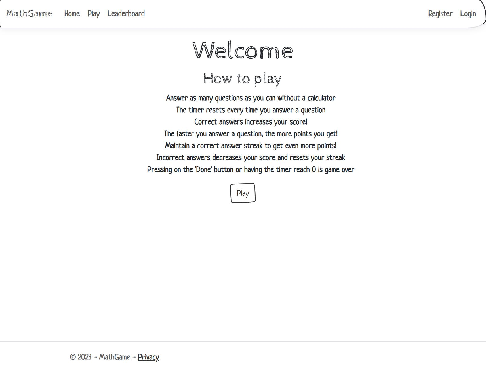
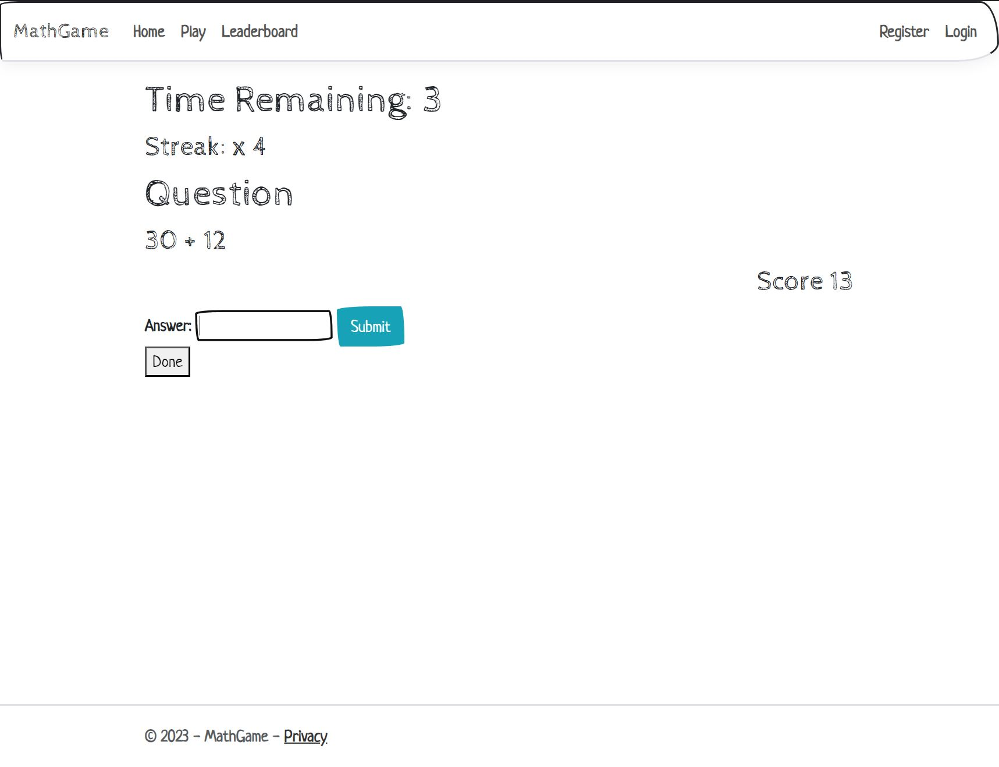
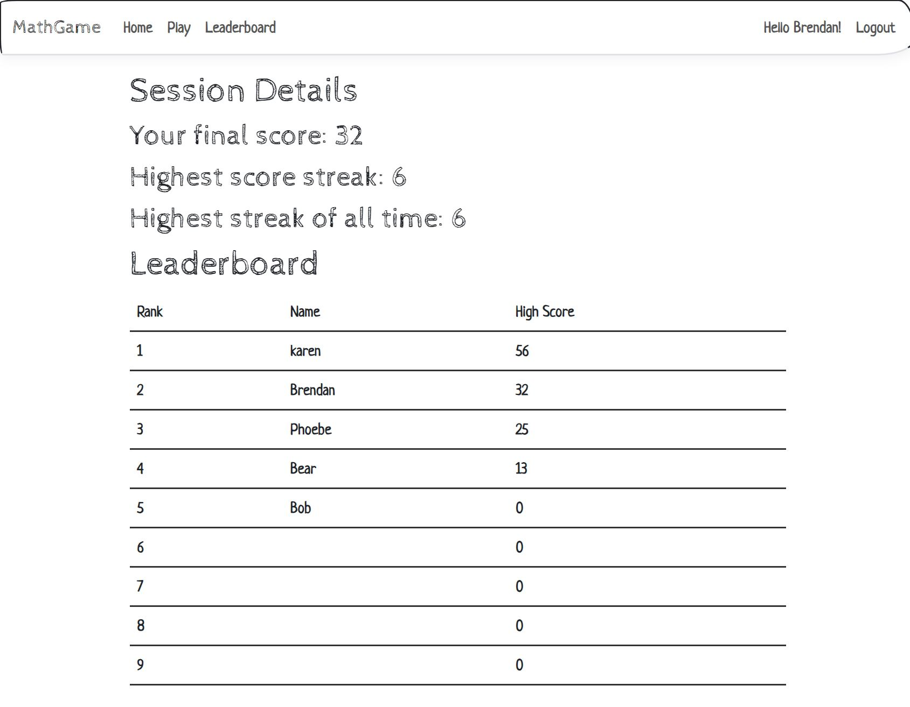

# MathGame
Fun math game that currently only has addition. Answer math questions that gradually get tougher over time and gain points by answering them correctly.

<h2>Description</h2>
This web-application allows you to challenge yourself and answer basic arithmetic questions that gradually get harder. Keep your brain sharp by practicing, and attempt
to get a better score every time you play! Challenge your friends! Register and login in order to save your progress and have your name be on the leaderboard! This math 
game rewards quick thinkers with a scoring system that gives more points the faster you answer questions. Additionally, the game features an answer streak system that provides even more points while you maintain your streak! 

<h2>Technical Description</h2>
This web application is built using the ASP.NET MVC Core framework, C#, and Razor to create a server-side application. It leverages ASP.NET Core's Entity framework to establish an Object Relational Mapper (ORM) for seamless connectivity with a local SQL Server. Model binding is implemented to facilitate the automatic mapping of incomming HTTP request data to the corresponding action method parameters. The application also utlizes ASP.NET Core's Identity framework to incorporate authentication with authorization.The SQL Server is managed and debugged using SQL Server Management Studio (SSMS). For the client-side, HTML, CSS, and Javascript are used, and the application is stylized using the CSS framework, Bootstrap.

<h2>Languages and Framework</h2>
<ul>
  <li>ASP.NET MVC Core</li>
  <li>Entity</li>
  <li>Identity</li>
  <li>Bootstrap</li>
  <li>C#</li>
  <li>Razor</li>
  <li>HTML</li>
  <li>CSS</li>
  <li>Javascript</li>
</ul>

<h2>Environments Used</h2>
<ul>
  <li>Windows 10</li>
  <li>Visual Studio 2022</li>
  <li>SQL Server Management Studio</li>
</ul>

<h2>Screenshots</h2>

Home Screen/How to Play

Answer as many as you can and get points!

Get your name on the leaderboard!

